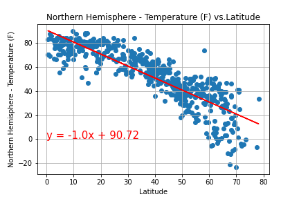

# Weather Analysis

Leveraging a [Python library](https://pypi.python.org/pypi/citipy) that generates cities based on latitude and longitude, and the [OpenWeatherMap API](https://openweathermap.org/api), I have creted a representative model of weather accross world cities.

My report includes a series of scatter plots showcasing the following relationships: 

* Temperature (F) vs. Latitude
* Humidity (%) vs. Latitude
* Cloudiness (%) vs. Latitude
* Wind Speed (mph) vs. Latitude

To generate these scatter plots, I have taken the following steps:

* I randomly selected over 500 unique (non-repeat) cities based on latitude and longitude.
* I performed a weather check on each of the cities using a series of successive API calls.
* I included a print log of each city as it's being processed with the city number and city name.
* I saved both a CSV of all data retrieved and png images for each scatter plot.

------

## Tools uitilized:

* APIs
* Jupyter Notebook
* Libraries used: Pandas, Matplotlib, Numpy

------

Contact: jorge.arriola.villafuerte@gmail.com
